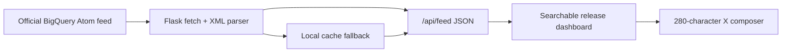

# BigQuery Release Pulse

BigQuery Release Pulse is a modern, light, and responsive web application that aggregates, categorizes, and searches the Google Cloud BigQuery Release Notes feed. It includes an interactive X (Twitter) Post Composer that features a real-time post preview, character limit validation, and a smart-shorten template.


## At a glance

| Verified behavior | Value |
| --- | ---: |
| Flask routes | **2** |
| Release-note categories | **4** |
| X composer limit | **280 characters** |
| Upstream timeout | **10 seconds** |
| External Python dependencies | **1** |

## Architecture preview



> **Prototype status:** the feed parser and UI currently have no automated
> tests. The direct development entry point also enables Flask debug mode, so
> use a production WSGI server for deployment.

---

## 🌟 Key Features

* **Live Feed & Offline Resilience**: Fetches the official Google Cloud BigQuery RSS Feed in real-time. Automatically saves cache files locally, allowing the system to operate offline seamlessly.
* **Granular Segmentation**: Parses the feed HTML to separate entries by update types (`Feature`, `Change`, `Deprecation`, `General`) so they can be read, searched, or shared individually.
* **Search & Filters**: Instant, client-side keyword search and category filters with update count pills.
* **Twitter/X Mockup Composer**:
  - Live preview formatted as an X post.
  - Interactive textarea with characters remaining.
  - Circular SVG indicator that turns amber and red as limits approach.
  - "Smart-Shorten" template button that optimizes character length to fit within the 280-character limit.
  - Immediate integration with Twitter's Web Intent portal for posting.

---

## 📂 Project Structure

```
BigQuery-event-talks-app/
├── static/
│   ├── app.js          # Client state, fetching, search, filter, composer logic
│   └── style.css       # Layout grids, glassmorphism design system, shimmers
├── templates/
│   └── index.html      # Structural HTML & mockup widgets
├── app.py              # Flask server, feed fetcher, XML parser & cache manager
├── requirements.txt    # Application requirements (Flask)
└── .gitignore          # Git exclusion rules
```

---

## 🚀 Getting Started

### Prerequisites

* **Python 3.8+** (installed on your system)
* **pip** (Python package installer)

### Setup & Execution

1. Clone this repository and navigate to the project directory:
   ```bash
   git clone https://github.com/Sriman-Kunda-056/BigQuery-event-talks-app.git
   cd BigQuery-event-talks-app
   ```

2. Install dependencies:
   ```bash
   pip install -r requirements.txt
   ```

3. Start the Flask server:
   ```bash
   python app.py
   ```

4. Open your web browser and navigate to:
   👉 **[http://localhost:5000](http://localhost:5000)**

---

## 🛠️ Tech Stack

* **Backend**: Python, Flask, `xml.etree.ElementTree` (Standard library XML parser)
* **Frontend**: HTML5 (Semantic structure), Vanilla Javascript (ES6), Vanilla CSS3 (Custom design system with CSS grid & variables)
